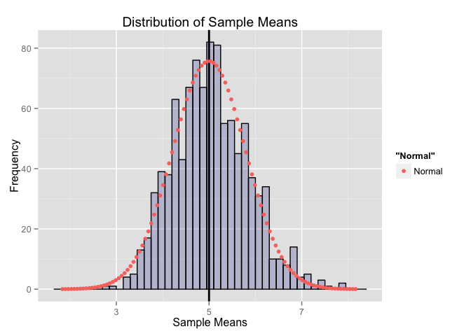
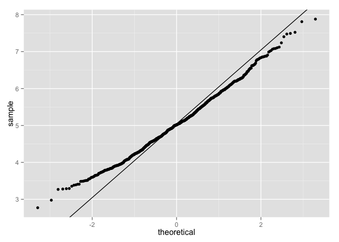

# Statistical Inference - Project Part I
Lefteris Nikolidakis  
September 21, 2014  

### Simulation of Exponential Distribution:
*The exponential distribution can be simulated in R with rexp(n, lambda) where lambda is the rate parameter. The mean of exponential distribution*  
*is 1/lambda and the standard deviation is also also 1/lambda. Set lambda = 0.2 for all of the simulations. In this simulation, you will investigate the distribution of averages of 40 exponential(0.2)s. Note that you will need to do a thousand or so simulated averages of 40 exponentials.*

*Illustrate via simulation and associated explanatory text the properties of the distribution of the mean of 40 exponential(0.2)s. You should*

*1. Show where the distribution is centered at and compare it to the theoretical center of the distribution.*  
*2. Show how variable it is and compare it to the theoretical variance of the distribution.*  
*3. Show that the distribution is approximately normal.*  
*4. Evaluate the coverage of the confidence interval for 1/lambda: x ± 1.96 * s/sqrt(n)*  
_______________________________________________________________________________________________

</br>
First I will generate 1000 simulations of 40 exponential values with rate = 0.2 and I will calculate the expected and observed summary statistics (mean, median, sd, SE):

```r
lambda = 0.2
n = 40 # the size of the sample 
noSim = 1000 # the number of simulations
meanExp = 1/lambda # Expexted average of the exponential distribution
mediaExp = meanExp
sdExp = 1/lambda # Expected standard deviation of the exponential 
se = sdExp/sqrt(n)  # Theoretical standard error - Expected sd of the exponential means.

set.seed(10) # Creating 10000 means of 40 values
values <- matrix(rexp(noSim * n, rate=0.2), nrow = noSim) # matrix of 40(values) x 1000(simulations)

means <- apply(values, MARGIN = 1, mean) # means of each simulation
seSim <- sd(means)  # standard error of the simulations - observed sd of the simulated means
meanSim <- mean(means) # observed mean of the simulated exponential means
mediaSim <- median(means) # observed median of the simulated exponential means 
```

With lambda = 0.2 the expected Mean from any exponential distribution is 1/lambda = 5, the expected standard deviation is 1/lambda = 5 and the expected stadard deviation of the Mean (standard error) is  5/sqrt(40) = 0.7906.  
Regarding our simulated data, the Mean of the means is 5.0451 and the Standard Error is 0.8088, which are quite close to the expected values. In addition, the Median = 5.0175 is quite close to the expected value as well which supports non-skewed data.  


The following plot displays a histogram of the simulated exponential data, with an overlay of a vertical line which corresponds to the theoretical mean and an overlay of an adjusted normal curve with mean equal to the expected mean of the exp(0.2) and sd equal to the expected standard error of the exp(0.2).


```r
library(ggplot2)
dat2 = data.frame(means)
g <- ggplot(dat2, aes(x=means)) + geom_histogram(alpha = .20, binwidth=0.15, colour = "black", fill = "dark blue")
g <- g + xlab("Sample Means") + ylab("Frequency") + ggtitle("Distribution of Sample Means")
g <- g + geom_vline(xintercept = meanExp, size = 1)
  
  # Generate scaled data from a normal distribution
  # x-axis
  x <- seq(meanExp-4*se, meanExp+4*se,length=100)  #length (-4,4) theoretical standard errors from the mean
  #y-axis
  y <- dnorm(x, mean=meanExp, sd = se) # generate 100 normal density values.
  y = y*noSim*0.15   #adjust the normal values to the Frequencies. 0.2 stands for the binwidth. 
  xy=data.frame(cbind(x,y))

# Overlay the normal curve in the histogram
g + geom_point(data = xy, aes(x = x, y = y, colour = 'Normal')) 
```

 

The Histogram shows that the distribution of the simulated samples mean is approximately Normal.  

To confirm that the distribution is approximately normal I created QQ-Plot, overlayed with the theoretical normal line.

```r
ggplot(dat2, aes(sample = means)) + stat_qq() + geom_abline(aes(intercept = mean(means), slope=1))
```

 

We notice in the QQ plot that the slope of the distribution of the data is a bit smaller than the theoretical's normal slope. Specifically more sample means are centered around the theoretical mean than in the normal destribution.


<br>
Now I will calculate a 95% Confidence Interval for the mean (1/lambda) of any simulated exponential distribution with n=40 values:

```r
CI <- meanExp +c(-1,1) * 1.96 * se/sqrt(n)
```
The evaluated CI is [4.755, 5.245] which implies that from all the simulations of 40 exponential values with lambda = 0.2, around 95% of them would contain a sample mean equal to the Expected (theoretical).


