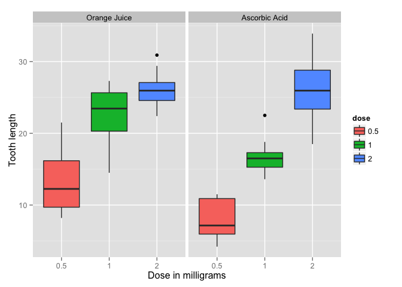

# Statistical Inference - Project Part II
Lefteris Nikolidakis  
September 21, 2014  
<br>

### ToothGrowth Data Analysis 

*Now in the second portion of the class, we're going to analyze the ToothGrowth data in the R datasets package.*  

*1. Load the ToothGrowth data and perform some basic exploratory data analyses.*  
*2. Provide a basic summary of the data.*  
*3. Use confidence intervals and hypothesis tests to compare tooth growth by supp and dose. (Use the*  
*techniques from class even if there's other approaches worth considering)*  
*4. State your conclusions and the assumptions needed for your conclusions.*
_____________________________________________________________________________________________________

For this project we are going to work with the ToothGrowth data built into R. These data come from an essay testing the effect of Vitamin C on tooth growth in Guinea Pigs. They consist of the measured tooth length (`len` variable) of 60 animals, divided into two groups depending on the delivery method of the Vitamin (`supp` variable) in Orange Juice or in Ascorbic Acid.  
Each of the two groups is also divided into 3 subgroups indicating the `dose` levels of Vitamin C `(0.5, 1, 2)` mg.


```r
#  basic summary of the data
data(ToothGrowth)
data <- ToothGrowth
data$dose <- factor(data$dose)
levels(data$supp) <- c("Orange Juice", "Ascorbic Acid") 
str(data)
```

```
## 'data.frame':	60 obs. of  3 variables:
##  $ len : num  4.2 11.5 7.3 5.8 6.4 10 11.2 11.2 5.2 7 ...
##  $ supp: Factor w/ 2 levels "Orange Juice",..: 2 2 2 2 2 2 2 2 2 2 ...
##  $ dose: Factor w/ 3 levels "0.5","1","2": 1 1 1 1 1 1 1 1 1 1 ...
```

```r
summary(data[])
```

```
##       len                  supp     dose   
##  Min.   : 4.2   Orange Juice :30   0.5:20  
##  1st Qu.:13.1   Ascorbic Acid:30   1  :20  
##  Median :19.2                      2  :20  
##  Mean   :18.8                              
##  3rd Qu.:25.3                              
##  Max.   :33.9
```

To check at a first glance, how the 2 delivery methods vary between the 3 doses, I will present an exploratory graph (boxplot).


```r
# exploratory graph
library(ggplot2)
ggplot(data, aes(x = dose, y = len)) + geom_boxplot(aes(fill = dose)) + facet_grid(. ~ supp) + 
  xlab("Dose in milligrams") + ylab("Tooth length")
```

 

The boxplot above shows that the tooth length increases as the dose increase in both OJ and VC delivery methods. Also the differences in tooth lengths between the delivery methods seems to be significant when the dose is 0.5 and 1 and almost the same when the dose is 2. 

#### T-tests
Now we will conduct multiple 2-sample t-tests to compare the difference in means between the 2 supp groups given a dose level.  
We make no assumptions about the population variances (whether constant or different), and therefore we will use safest approach considering different variances in the populations.  
Also all guinea pigs in each test (dose level and delivery method) were different, and therefore we will not consider the data as "paired". 
</br>

- In the first t-test, our Null hypothesis is that the Mean tooth lengths for each of the 2 different delivery methods are equal, given a dose level of 0.5 mg.


```r
data_05 <- data[data$dose == 0.5, ]
t.test(len ~ supp, paired=F, var.equal=F, data_05)
```

```
## 
## 	Welch Two Sample t-test
## 
## data:  len by supp
## t = 3.17, df = 14.97, p-value = 0.006359
## alternative hypothesis: true difference in means is not equal to 0
## 95 percent confidence interval:
##  1.719 8.781
## sample estimates:
##  mean in group Orange Juice mean in group Ascorbic Acid 
##                       13.23                        7.98
```

The `p-value = 0.006359`, which is quite small and statistically significant at the 5% Confidence level, therefore we reject the Null hypothesis. To a great extent, what this p-value implies is that there is 0.6% chance to osbserve such a mean difference from such an experiment given the dose=0.5.  
In adition the Confidence Interval `[1.719 8.781]` doesn't contain zero.  
</br>

- In the second t-test, our Null hypothesis is that the Mean tooth lengths for each of the 2 different delivery methods are equal, given a dose level of 1 mg.

```r
data_1 <- data[data$dose == 1, ]
t.test(len ~ supp, paired=F, var.equal=F, data_1)
```

```
## 
## 	Welch Two Sample t-test
## 
## data:  len by supp
## t = 4.033, df = 15.36, p-value = 0.001038
## alternative hypothesis: true difference in means is not equal to 0
## 95 percent confidence interval:
##  2.802 9.058
## sample estimates:
##  mean in group Orange Juice mean in group Ascorbic Acid 
##                       22.70                       16.77
```

Similarly the `p-value = 0.006359`, is statistically significant at the 5% Confidence level and therefore we reject the Null hypothesis.  
</br>

- In the third t-test, our Null hypothesis is that the Mean tooth lengths for each of the 2 different delivery methods are equal, given a dose level of 2 mg.

```r
data_2 <- data[data$dose == 2, ]
t.test(len ~ supp, paired=F, var.equal=F, data_2)
```

```
## 
## 	Welch Two Sample t-test
## 
## data:  len by supp
## t = -0.0461, df = 14.04, p-value = 0.9639
## alternative hypothesis: true difference in means is not equal to 0
## 95 percent confidence interval:
##  -3.798  3.638
## sample estimates:
##  mean in group Orange Juice mean in group Ascorbic Acid 
##                       26.06                       26.14
```

For a dose of 2 mg `p-value = 0.9639` is quite big, and therefore we fail to reject the Null Hypothesis. We can also see from the Confidence Interval `[-3.798  3.638]` that the absolute endpoints are almost equal.

#### Conclusion
The delivery method is quite significant when the dosage is between 0.5 and 1 mg, with orange juice being more effective than ascorbic acid,  but is no longer of influence when dosing 2 mg. 
